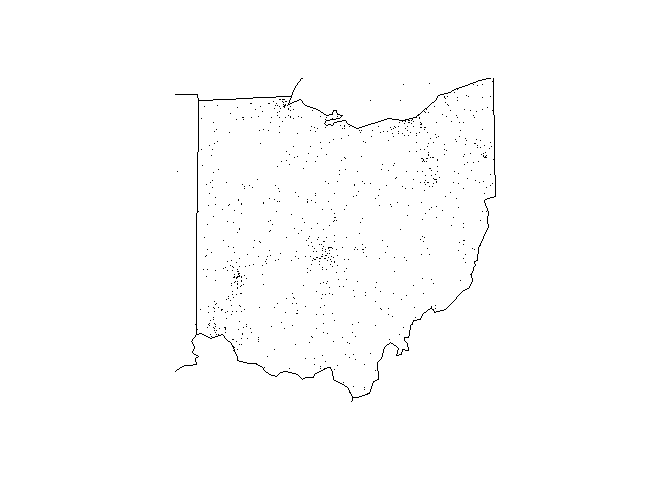

<!-- README.md is generated from README.Rmd. Please edit that file -->
Introduction to fars
====================

The `fars` package analyses data from the US National Highway Traffic Safety Administration's [Fatality Analysis Reporting System](https://www.nhtsa.gov/research-data/fatality-analysis-reporting-system-fars), which is a nationwide census providing the American public yearly data regarding fatal injuries suffered in motor vehicle traffic crashes.

Summarize accidents
-------------------

If you are interested in the number of accidents per month and year, you can count them with the `fars_summarize_years` function. You only need to provide the `years` of interest. The function will create the `filename`s using the `make_filename` function, read in the files from your current working directory using the `fars_read` function, and finally summarize the data.

``` r
fars_summarize_years(2013:2015)
#> # A tibble: 12 × 4
#>    MONTH `2013` `2014` `2015`
#> *  <int>  <int>  <int>  <int>
#> 1      1   2230   2168   2368
#> 2      2   1952   1893   1968
#> 3      3   2356   2245   2385
#> 4      4   2300   2308   2430
#> 5      5   2532   2596   2847
#> 6      6   2692   2583   2765
#> 7      7   2660   2696   2998
#> 8      8   2899   2800   3016
#> 9      9   2741   2618   2865
#> 10    10   2768   2831   3019
#> 11    11   2615   2714   2724
#> 12    12   2457   2604   2781
```

Map accidents
-------------

In order to display the point locations of accidents for a given state `state.num` and `year`, you can use the `fars_map_state` function.

``` r
fars_map_state(39, 2013)
```


